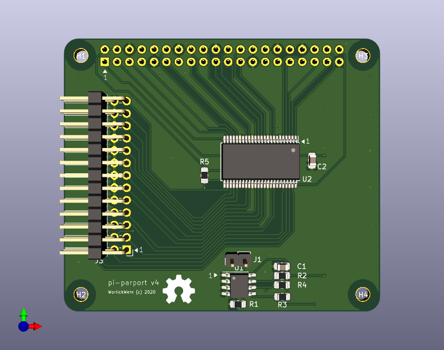

## pi-parport

This is a Raspberry Pi HAT that implements a PC-style parallel port.
GPIO pins are organized as data, status, and control registers.
The HAT includes a buffer chip that converts from the GPIB 3V3 logic
to signals that conform to IEEE 1284.  A 26 pin IDC header on the
board connects to your DB25 connector.  A `parport-gpio` driver and
device tree overlay integrate the HAT with the Linux parport driver stack.




### Why?

I wanted to use a parallel port based cooled astronomy camera,
but preferred to use the compact and low-power Raspberry Pi
over a PC at the telescope.  Parallel ports are simple devices.
Why not build one?

### What works?

See [wiki](https://github.com/worlickwerx/pi-parport/wiki) for notes on some
devices, and please share your experience if you try something new.

The following limitations of this implementation may affect software and
hardware that uses the parallel port:
1) The software cannot directly read and write the x86 port addresses,
as was the custom early on.  In user space, software must use the ppdev
ioctl interface.  In the kernel, software must use the (generic)
`struct parport` operations.
2) The GPIO multiplexing/de-multiplexing and/or system call access may
impact the direct-access latency assumed by some bit-banged drivers.
On a Pi 3, user space code can toggle a parallel port line at about 250 kHz.

### Why not use a USB Parallel Port?

Many USB parallel port devices appear to Linux as a USB printer, bypassing
the parport driver stack.  If your application is a printer, go for it.

### Building the driver

For convenience, the generic parport code is duplicated in this repo,
since the Raspberry Pi Foundation does not ship the compiled modules
in the `raspberrypi-kernel` package (at least in old Raspbian
versions).  If you are intending to use a specific old version of
Raspbian, there is the shell script `get_parport_src.sh` to assist
you in getting the code from that particular version.

Clone this repo, then run the following with `${TOPDIR}` representing the
top level directory of the cloned repo:
```console
$ sudo apt install build-essential raspberrypi-kernel-headers
$ cd ${TOPDIR}/driver
$ make
make -C /lib/modules/4.19.75-v7+/build M=${TOPDIR}/driver modules
make[1]: Entering directory '/usr/src/linux-headers-4.19.75-v7+'
  CC [M]  ${TOPDIR}/driver/parport/share.o
  CC [M]  ${TOPDIR}/driver/parport/ieee1284.o
  CC [M]  ${TOPDIR}/driver/parport/ieee1284_ops.o
  CC [M]  ${TOPDIR}/driver/parport/procfs.o
  CC [M]  ${TOPDIR}/driver/parport/daisy.o
  CC [M]  ${TOPDIR}/driver/parport/probe.o
  LD [M]  ${TOPDIR}/driver/parport/parport.o
  CC [M]  ${TOPDIR}/driver/parport/lp.o
  CC [M]  ${TOPDIR}/driver/parport/ppdev.o
  CC [M]  ${TOPDIR}/driver/parport_gpio.o
  Building modules, stage 2.
  MODPOST 4 modules
  CC      ${TOPDIR}/driver/parport/lp.mod.o
  LD [M]  ${TOPDIR}/driver/parport/lp.ko
  CC      ${TOPDIR}/driver/parport/parport.mod.o
  LD [M]  ${TOPDIR}/driver/parport/parport.ko
  CC      ${TOPDIR}/driver/parport/ppdev.mod.o
  LD [M]  ${TOPDIR}/driver/parport/ppdev.ko
  CC      ${TOPDIR}/driver/parport_gpio.mod.o
  LD [M]  ${TOPDIR}/driver/parport_gpio.ko
make[1]: Leaving directory '/usr/src/linux-headers-4.19.75-v7+'
```

### Installing the Device Tree Overlay

The device tree overlay maps specific GPIO pins to their functions in
the driver.  This must be compiled and loaded:
```console
$ cd ${TOPDIR}/dts
$ make
$ sudo make install
```
The ID EEPROM stores the name of the DT Overlay to use, and the
corresponding DT Overlay will be automatically loaded on boot.  If you
will not be using an ID EEPROM, then add the following line to
`/boot/config.txt`:
```
dtoverlay=parport-gpio
```
The default drive mode of the parallel port output pins is
"totem-pole" mode, which means that a high current source is provided
for both logic level 1 and 0.  If you wish logic level 1 to be a low
current source provided by pull-up resistors, i.e. "open-drain" mode,
then you can set the following DT Overlay parameter:
```
dtoverlay=parport-gpio,hd=0
```
Note that if you are using an EEPROM, you will have to include the
full DT Overlay data within your EEPROM since you cannot simply
specify a parameter when loading by that method.

Then reboot the pi to pick up the new config.

### Installing the Modules

Install the modules to allow Linux Device Tree to automatically load
them.
```console
$ cd ${TOPDIR}/driver
$ sudo make install
```
Note that only the `parport` and `parport_gpio` base modules will
autoload, the `ppdev` and `lp` modules will still need to be specified
in `/etc/modules` or otherwise.  Also, note that you will need to
rebuild and reinstall the modules when you update your kernel version.

### Loading the Modules

If you did not install the modules, after rebooting, load the base
modules like this:
```console
$ cd ${TOPDIR}
$ sudo insmod driver/parport/parport.ko
$ sudo insmod driver/parport_gpio.ko
```
You'll see the port announce itself on the console:
```console
[4425200.988400] parport-gpio ppgpio@0: data on pins [22,23,24,10,25,9,8,11]
[4425200.988412] parport-gpio ppgpio@0: status on pins [18,17,4,3,2]
[4425200.988422] parport-gpio ppgpio@0: control on pins [26,19,6,13]
[4425200.988430] parport-gpio ppgpio@0: hd on pin 20
[4425200.988438] parport-gpio ppgpio@0: dir on pin 21
```
If you wish to set up a parallel printer:
```console
$ sudo insmod parport/lp.ko
```
If you wish to run user-space programs that use the parallel port:
```console
$ sudo insmod parport/ppdev.ko
```

### hardware

The latest hardware includes an ID EEPROM to conform with the
[Raspberry Pi HAT Specification](https://github.com/raspberrypi/hats),
and was designed with [KiCAD](https://www.kicad.org/).
As with the previous versions, the
[SN74LVC161284 19-bit bus interface with 3-state outputs](http://www.ti.com/product/SN74LVC161284) takes care of buffering and line conditioning.

Version 4 is shared on
[OSHPARK](https://oshpark.com/shared_projects/0Ioh20Gk).
See the [Bill of Materials](hardware/v4/BOM.md) for parts to place on
the board.

Populating the EEPROM and associated components on a board you're making
yourself is optional.

Check out the [test](test/) directory for some simple "smoke tests"
on your assembled pi-parport board before attaching your more
expensive equipment.

Schematics and design files for [previous versions](hardware/)
are still available for reference.

### Release

Share and enjoy!

#### Software License

SPDX-License-Identifier: GPL-2.0-or-later

#### Hardware License

SPDX-License-Identifier: CERN-OHL-1.2
